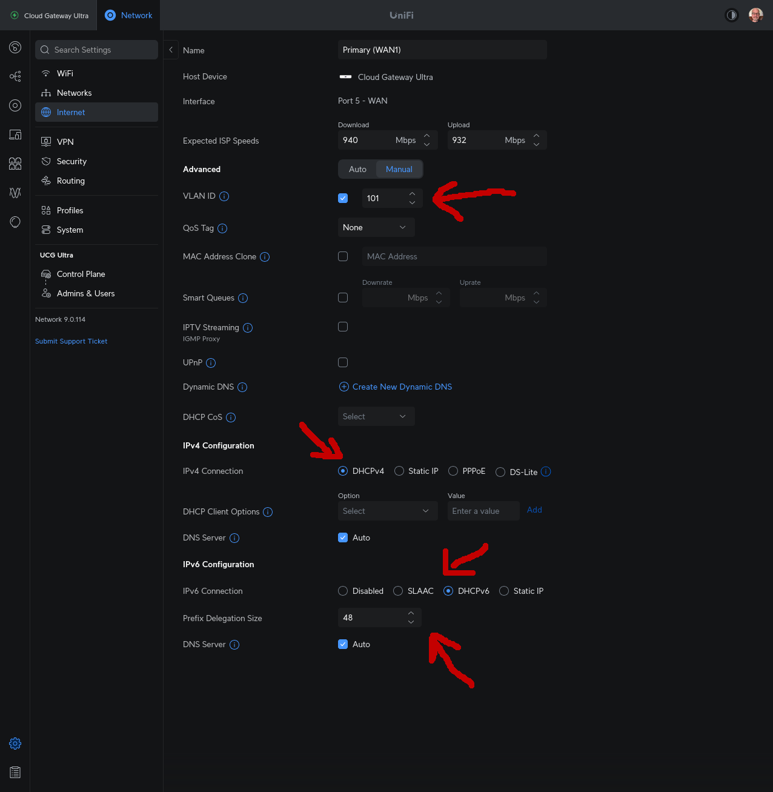
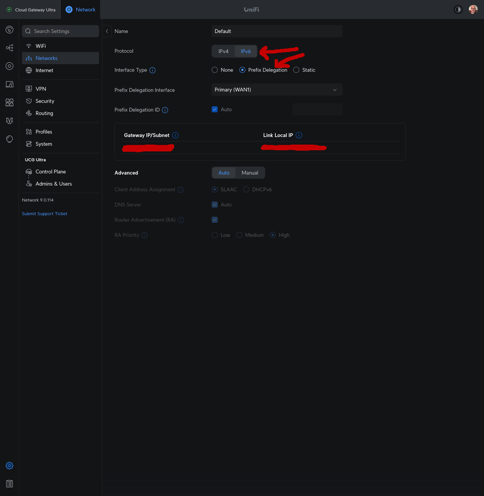
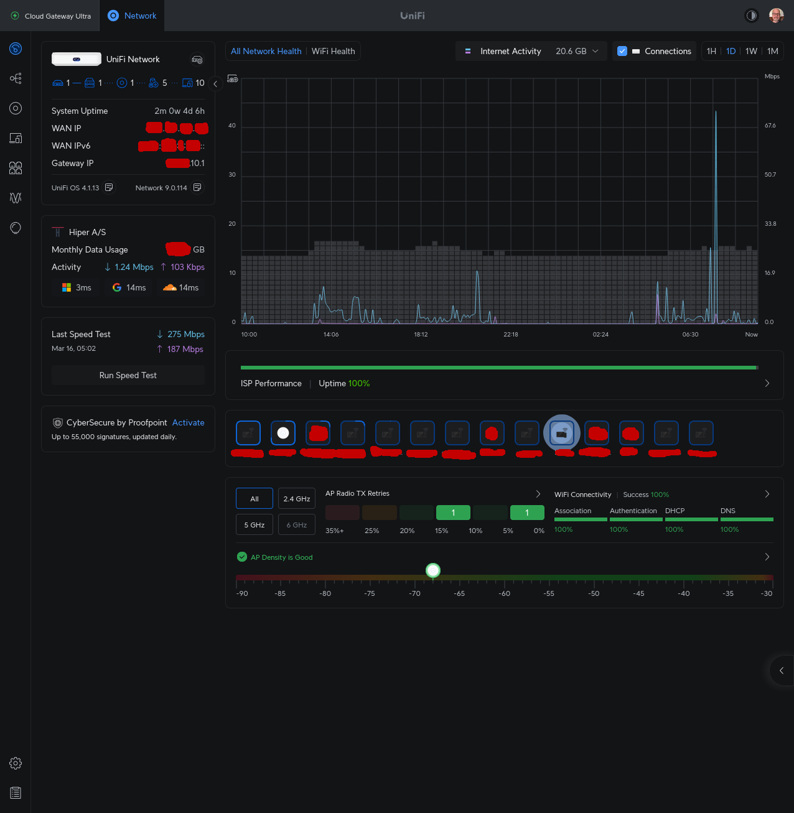
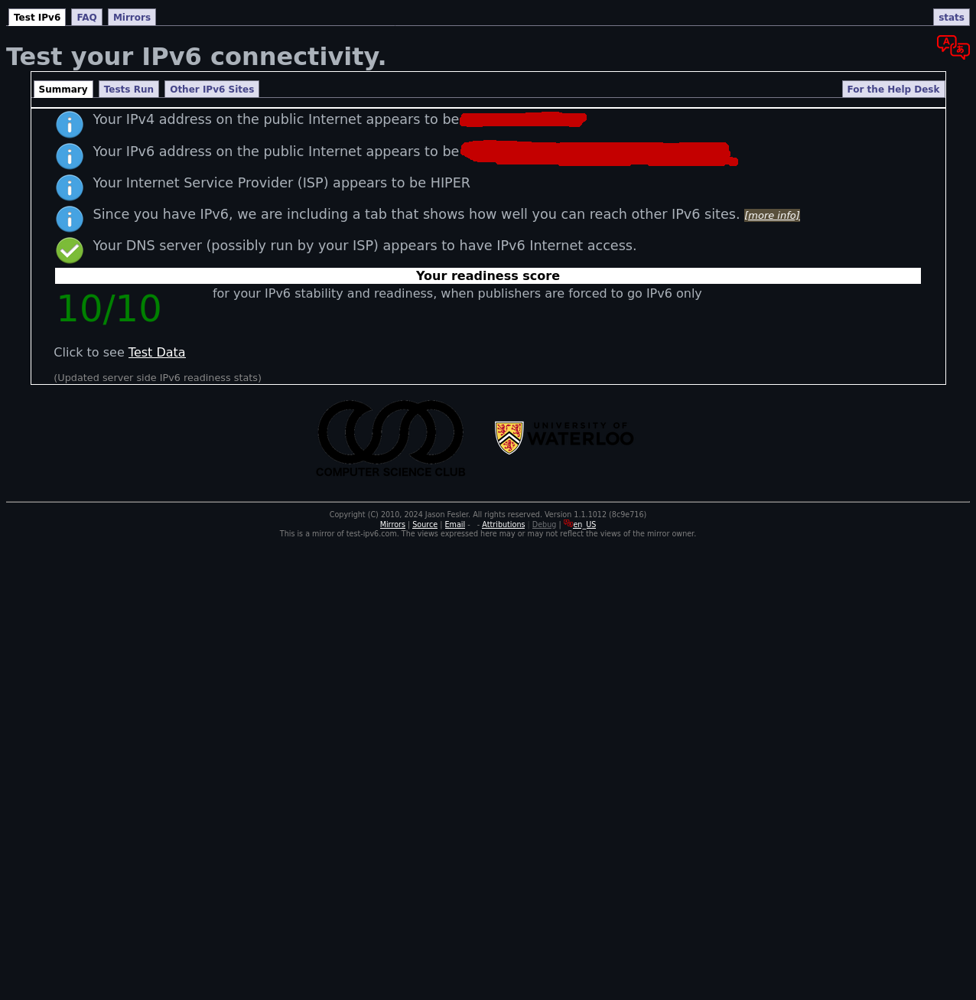

# Setting Up IPv6 on a Ubiquiti Router with Hiper Internet

This guide explains how to configure a Ubiquiti router for IPv6 support on the Hiper network using the UniFi Network Controller. While many of the steps are similar for other Nuuday ISPs, this guide is tailored for Hiper.

For this example, I am using the UCG-Ultra running UniFi OS version 4.1.13 with Network version 9.0.114. The Ubiquiti router should be connected directly to the fiber ONT box.

---

## 1. Configure the Internet Connection (WAN)

These steps will enable your WAN connection and set up IPv6:

1. **Navigate to Settings:**  
   Click the gear icon and select **Internet**.

2. **Enable VLAN Tagging:**  
   Hiper (and most other Nuuday ISPs) use VLAN tagging on the WAN interface. Check the VLAN tagging option and enter **101** as the VLAN ID.

3. **Set DHCP for Both IPv4 and IPv6:**  
   - Ensure both IPv4 and IPv6 are set to **DHCP**.
   - For IPv6, set the **Prefix Delegation Size** to **48**.

4. **Reference Screenshot:**  
   

---

## 2. Configure IPv6 on the LAN

Follow these steps to enable IPv6 on your LAN:

1. **Access Network Settings:**  
   Click the gear icon, then go to **Networks**. Select your network from the list (the default name is "Default").

2. **Set Up IPv6:**  
   - Click the **IPv6** tab.
   - Change the **Interface Type** to **Prefix Delegation**.

3. **Reference Screenshot:**  
   

---

## 3. Verify IPv6 Functionality

Ensure that IPv6 is working properly:

1. **Check the WAN Side:**  
   Open the landing page of the Network Controller application. You should see details similar to the screenshot below:
   
   

2. **Test LAN Devices:**  
   Devices on your LAN should now receive an IPv6 address and be able to access the internet. Verify by visiting [Test IPv6](https://test-ipv6.csclub.uwaterloo.ca/)—a perfect configuration will yield a 10/10 score.
   
   

---

## Final Words

- **Feedback:** If you find any errors or have suggestions for improvements, feel free to open an issue or submit a pull request.
- **Support:** I no longer use Hiper myself, but I will do my best to assist if you encounter any problems.

